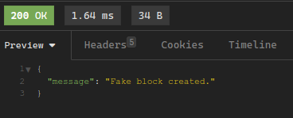

# Fake Blockchain implementation

## Installation

Clone the repository :

```bash
git clone https://github.com/leoroullois/blockchain.git && cd blockchain
```

Start the server :
```bash
python3 main.py
```

The server will listen on `http://localhost:5000`.

## API

There is different routes to interact with the blockchain :

- `/mine_block` : Mine a block


- `/get_chain` : returns all the blocks of the blockchain


- `/valid` : Checks if the blockchain is valid


- `/create-fake-block` : Create a fake non-valid block

